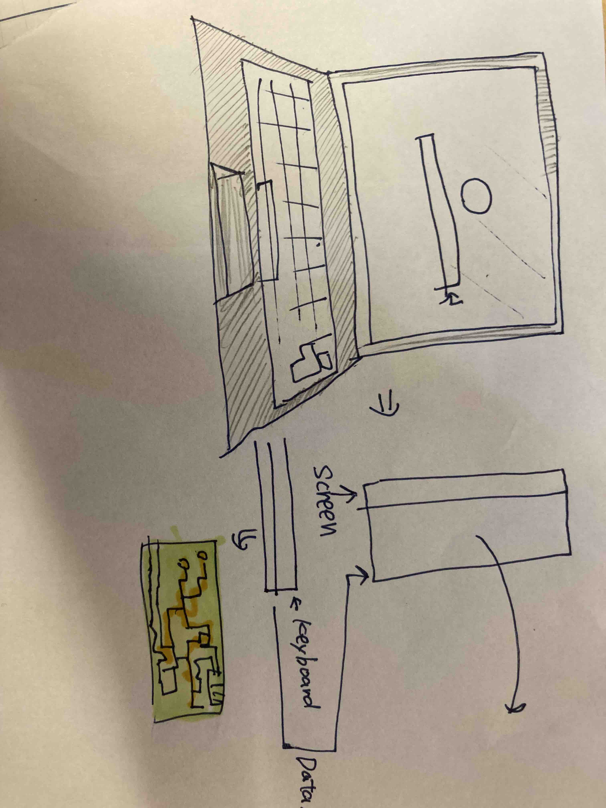

#lesson2 working with github markdown files
A markdown file is
#my first picture of a computer

**Fig.1** My first try at drawing a computer << This is a figure caption

In **Fig.1** I tried to draw a computer
